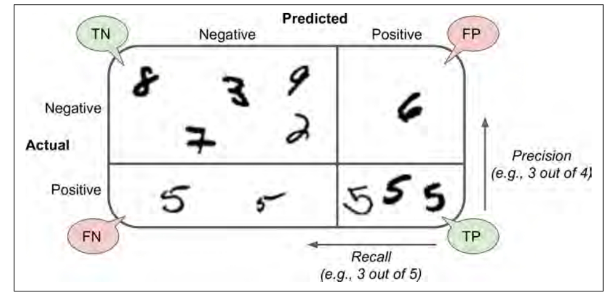
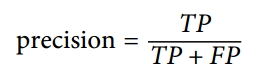
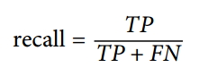
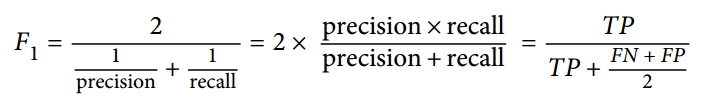

# Binary Classification

## Purpose: identified the image is 5 or not
A good way to evaluate a model is to use cross-validation. We use the cross_val_score() function to evaluate SGDClassifier model
using K-fold cross-validation, with three folds. The accuracy is above 95% on all cross-validation folds. But don't happy too early, because only about 10% of the images are 5, so if you always guess that an image is not 5, you will be right about 90% of the time.

This demonstrates why accuracy is generally not the preferred performance measure for classifiers, especially when you are dealing with skewed datasets (i.e., when some classes are much more frequent than others).

A much better way to evaluate the performance of a classifier is to look at the confusion matrix. We first to introduce some nouns.

1. TN is the number of true negatives.

2. FP is the number of false positives.

3. FN is the number of false negatives.

4. TP is the number of true positives.

The general idea of confusion matrix is to count the number of times instances of class A are classified as class B. Each row in a confusion matrix represents an actual class, while each column represents a predicted class. A perfect classifier would have only true positives and true negatives, so its confusion matrix would have nonzero values only on its main diagonal.

 

The confusion matrix gives you a lot of information, but sometimes you may prefer a more concise metric.

 

A trivial way to have perfect precision is to make one single positive prediction and ensure it is correct. So precision is typically used
along with another metric named recall, also called sensitivity or true positive rate(TPR): this is the ratio of positive instances that are correctly detected by the classifier

 

Scikit-Learn provides confusion_matrix(), precision_score() and rerecall_score() to compute confusion matrix, precision and recall. After using this function, we can find that the 5-detector does not look as shiny as it did when we looked at its accuracy. When it claims an image represents a 5, it is correct only 80% of the time. Moreover, it only detects 82% of the 5.

There is another metric called F1 score. The F1 score combined precision and recall into a single metric. To compute the F1 score, simply call the f1_score() function.

The classifier will only get a high F1 score if both recall and precision are high. But increasing precision reduces recall, and vice versa. This is called the precision/recall tradeoff.

* SGDClassifier

Scikit-Learn’s SGDClassifier class has the advantage of being capable of handling very large datasets efficiently

*

# Multiclass Classifiation