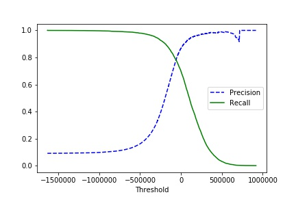
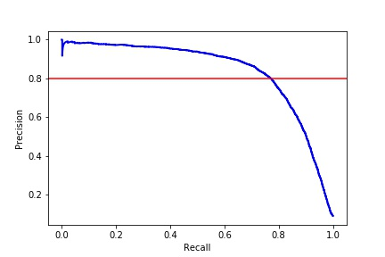

# Binary Classification

## Purpose: identified the image is 5 or not
A good way to evaluate a model is to use cross-validation. We use the cross_val_score() function to evaluate SGDClassifier model
using K-fold cross-validation, with three folds. The accuracy is above 95% on all cross-validation folds. But don't happy too early, because only about 10% of the images are 5, so if you always guess that an image is not 5, you will be right about 90% of the time.

This demonstrates why accuracy is generally not the preferred performance measure for classifiers, especially when you are dealing with skewed datasets (i.e., when some classes are much more frequent than others).

A much better way to evaluate the performance of a classifier is to look at the confusion matrix. We first to introduce some nouns.

1. TN is the number of true negatives.

2. FP is the number of false positives.

3. FN is the number of false negatives.

4. TP is the number of true positives.

The general idea of confusion matrix is to count the number of times instances of class A are classified as class B. Each row in a confusion matrix represents an actual class, while each column represents a predicted class. A perfect classifier would have only true positives and true negatives, so its confusion matrix would have nonzero values only on its main diagonal.

 

The confusion matrix gives you a lot of information, but sometimes you may prefer a more concise metric.

 

A trivial way to have perfect precision is to make one single positive prediction and ensure it is correct. So precision is typically used
along with another metric named recall, also called sensitivity or true positive rate(TPR): this is the ratio of positive instances that are correctly detected by the classifier

 

Scikit-Learn provides confusion_matrix(), precision_score() and rerecall_score() to compute confusion matrix, precision and recall. After using this function, we can find that the 5-detector does not look as shiny as it did when we looked at its accuracy. When it claims an image represents a 5, it is correct only 80% of the time. Moreover, it only detects 82% of the 5.

There is another metric called F1 score. The F1 score combined precision and recall into a single metric. To compute the F1 score, simply call the f1_score() function.

The classifier will only get a high F1 score if both recall and precision are high. But increasing precision reduces recall, and vice versa. This is called the precision/recall tradeoff.

To understand this tradeoff, let’s look at how the SGDClassifier makes its classification decisions. For each instance, it computes a score based on a decision function, and if that score is greater than a threshold, it assigns the instance to the positive class, or else it assigns it to the negative class. Below figure shows that from left to right the score goes higher. Suppose the decision threshold is positioned at the central arrow (between the two 5s): the precision is 80% and the recall is 67%. if you raise the threshold yo next arrow, the precision is 100% and the recall is 50%. Conversely, lowering the threshold increases recall and reduces precision.

Scikit-Learn does not let you set the threshold directly, but it does give you access to the decision scores that it uses to make predictions. So, you can call its decision_function() method, which returns a score for each instance, Or getting the scores of all instances in the training set using the cross_val_predict() function, but specifying method="decision_function", it will return decision scores instead of predictions, and then make predictions based on those scores using any threshold you want.

After these scores be calculated, we can compute precision and recall for all possible thresholds using the precision_recall_curve() function. Below figure plot precision and recall as functions of the threshold value.

We discover precision may sometimes go down when the threshold raise. The previous figure can explain this phenomenon. When we start from the central threshold and move it just one digit to the right: precision goes from 4/5 (80%) down to 3/4 (75%). On the other hand, recall can only go down when the threshold is increased, which explains why its curve looks smooth.

Now we can simply select the threshold value that gives the best precision/recall tradeoff. Another way to select a good precision/recall tradeoff is to plot precision directly against recall, as shown in next figure.

It is to find that precision really starts to fall sharply around 80% recall. we will probably want to select a precision/recall tradeoff just before that drop. For example, at around 60% recall. 

The last metric we want to talk is receiver operating characteristic curve (ROC). The ROC curve is another common tool used with binary classifiers. It plots the true positive rate (another name for recall) against the false positive rate. The FPR is the ratio of negative instances that are incorrectly classified as positive. It is equal to one minus the true negative rate, which is the ratio of negative instances that are correctly classified as negative. 

Final, Let’s train a RandomForestClassifier and compare its ROC curve to the SGDClassifier. By the way, To illustrate the ROC curve. First, we need to get scores for each instance in the training set, but the RandomForestClassifier class does not have a decision_function() method. Instead it has a predict_proba() method. The predict_proba() method returns an array containing a row per instance and a column per class, each containing the probability that the given instance belongs to the given class. So, we use the positive class’s probability as the score. Second, we use the roc_curve() function to plot the ROC curve on two modle.  

Once again there is a tradeoff: the higher the recall (TPR), the more false positives (FPR) the classifier produces. The dotted line represents the ROC curve of a purely random classifier; a good classifier stays as far away from that line as possible (toward the top-left corner). 

The RandomForestClassifier’s ROC curve looks much better than the SGDClassifier’s, it comes much closer to the top-left corner. If the curve is not significant to identify which one is better, we may calculate the area under the curve (AUC). Scikit-Learn also provides the function roc_auc_score to calculate the AUC.

* [SGDClassifier](http://scikit-learn.org/stable/modules/generated/sklearn.linear_model.SGDClassifier.html)

The SGDClassifier uses a threshold equal to 0

Scikit-Learn’s SGDClassifier class has the advantage of being capable of handling very large datasets efficiently.

* [RandomForestClassifier](http://scikit-learn.org/stable/modules/generated/sklearn.ensemble.RandomForestClassifier.html)

# Multiclass Classifiation